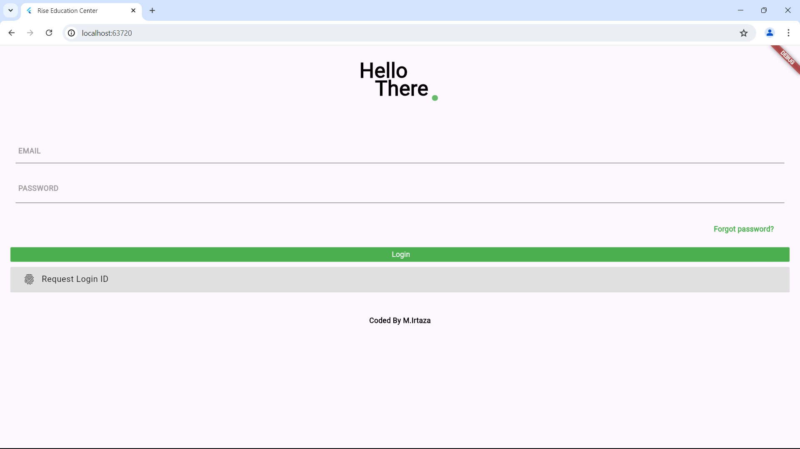
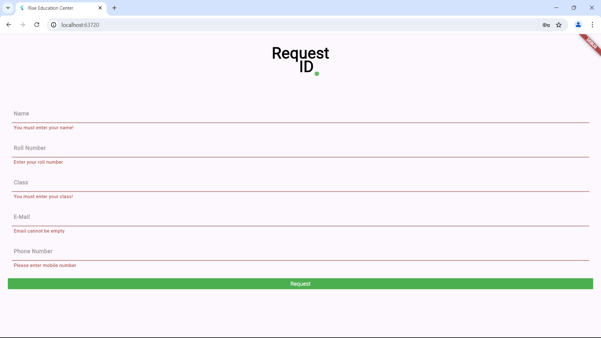
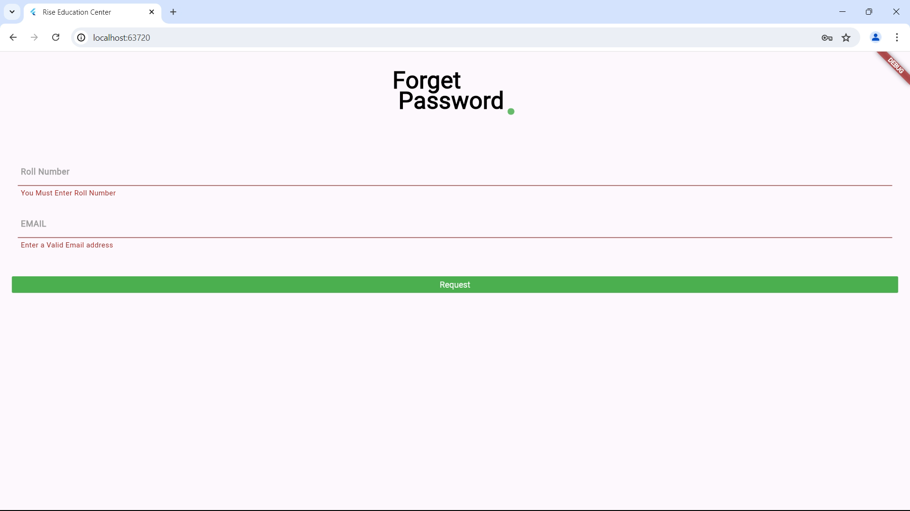
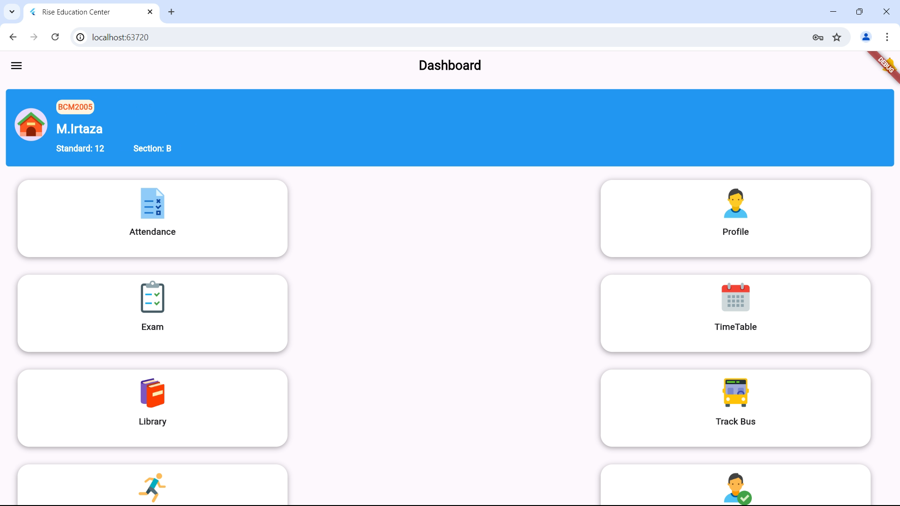
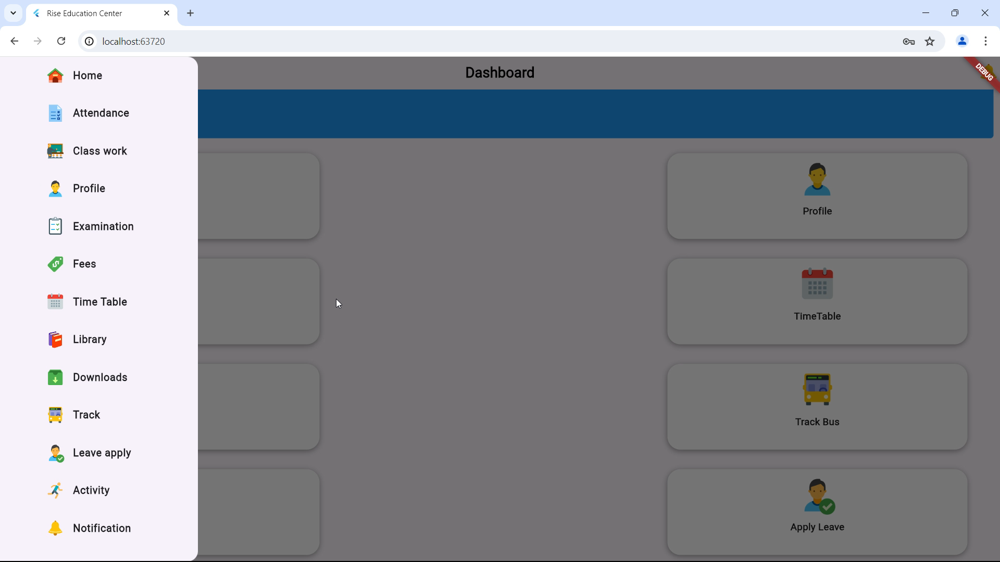
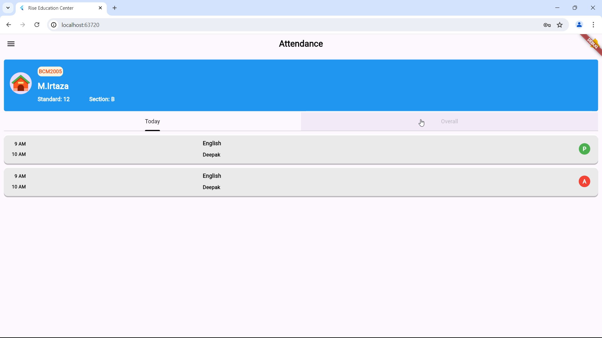
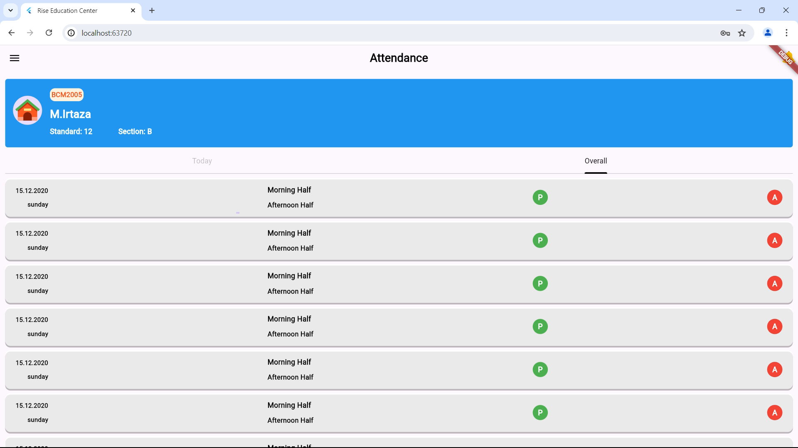
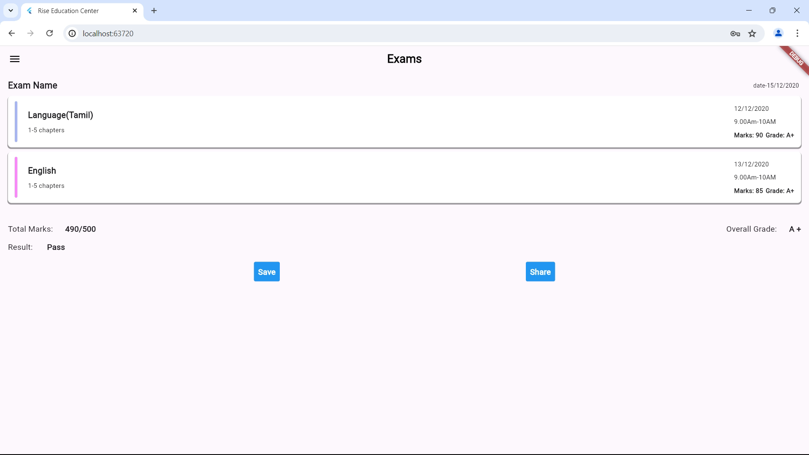

# 🏢 School Management System - Flutter
- I used this Project to Learn Flutter & Dart to Enhance my Knowledge in Flutter Application.
- It was Also a Task given to me.
- This Project is not Completed but it Runs very well with Nice & Smooth Animations.
- Remember to Follow the Instructions Carefully to Make it Run. 

---

<details>
  <summary align="center"><strong>Demo Images</strong> <p> (Click to Preview) </p></summary>
  <div class="img_layout">
  
  
  
  
  
  
  
  
  </div>
  </details>

  <style>
    .img_layout {
      display:grid;
      grid-template-columns: auto auto auto;
      gap: 0.5rem;
    }
  </style>

---
A **Flutter Web** and **Mobile** application for managing school operations, authentication, and data handling. This project includes Firebase authentication and Google Sign-In.

---

## 🚀 Features
✅ User Authentication (Email & Google Sign-In)  
✅ Student & Teacher Management  
✅ Real-time Firebase Database Integration  
✅ Responsive UI (Web & Mobile)  
✅ Beautiful UI with Flutter Widgets  

---

## 📌 Prerequisites

Make sure you have the following installed before running the project:

- [Flutter SDK](https://docs.flutter.dev/get-started/install) (Latest Version)
- [Dart SDK](https://dart.dev/get-dart)
- [Android Studio](https://developer.android.com/studio) / [VS Code](https://code.visualstudio.com/)
- Flutter dependencies (`pub get` will install these)
- Firebase Project (Set up in [Firebase Console](https://console.firebase.google.com/))

---

## 🛠️ Installation & Setup

### 1⃣ Clone the Repository
```bash
git clone https://github.com/your-username/school-management.git
cd school-management
```

### 2⃣ Install Dependencies
Run the following command in the project directory:
```bash
flutter pub get
```

### 3⃣ Firebase Setup
- Create a **Firebase Project** on [Firebase Console](https://console.firebase.google.com/).
- Enable **Authentication** (Email/Password, Google Sign-In).
- Set up **Firestore Database**.
- Download the `google-services.json` (Android) and `firebase_options.dart` (for Web).
- Ensure your `firebase_options.dart` is correctly generated using:
  ```bash
  flutterfire configure
  ```

### 4⃣ Run the App
For **Web**:
```bash
flutter run -d chrome
```
For **Android**:
```bash
flutter run -d android
```
For **iOS**:
```bash
flutter run -d ios
```

---

## ⚠️ Troubleshooting

🛠️ **Stuck on "Waiting for another Flutter command..."?**  
🔹 Delete `flutter/bin/cache/lockfile` and restart your IDE.  

🛠️ **Firebase-related issues?**  
🔹 Ensure your `firebase_options.dart` is generated correctly.  

🛠️ **Getting an error while running `flutter pub get`?**  
🔹 Try `flutter clean` and then `flutter pub get`.  

🛠️ **Web Firebase authentication not working?**  
🔹 Ensure your `authDomain` is correctly set in `firebase_options.dart`.

---

## 🐝 License
This project is open-source under the **MIT License**.

---

## 👨‍💻 Contributing
Feel free to fork this repository and submit a pull request with improvements! 😊

---

### 🌟 If you find this project helpful, consider giving it a ⭐ on GitHub!
